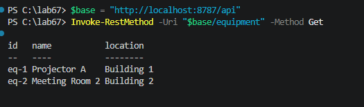
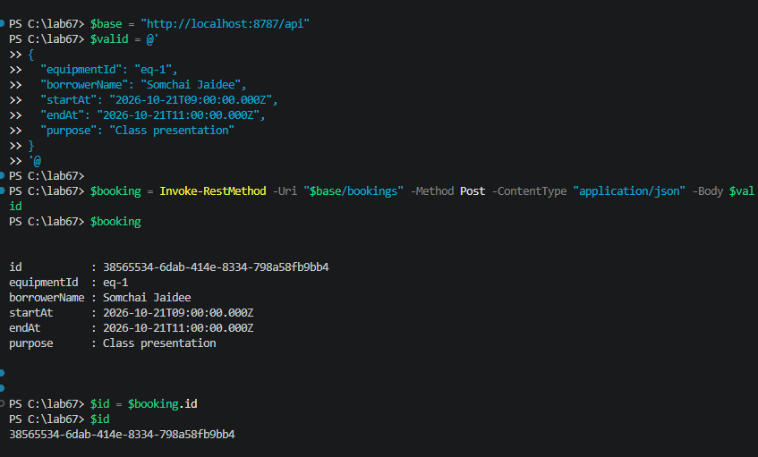
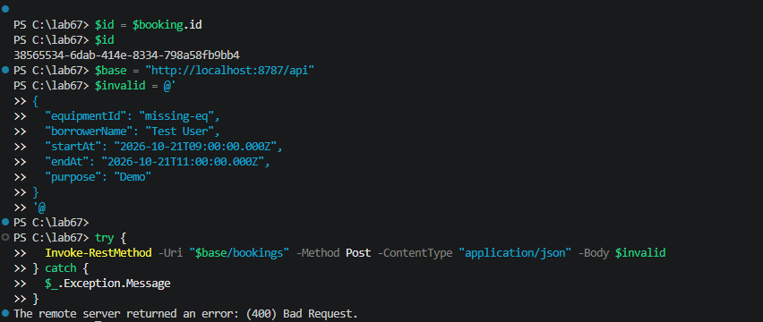
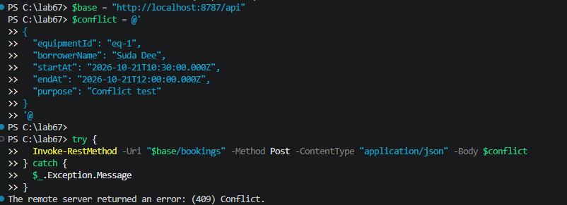
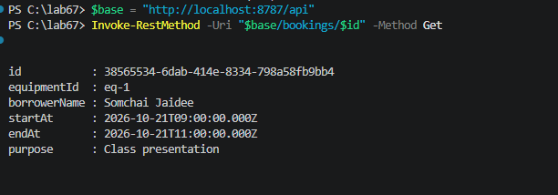
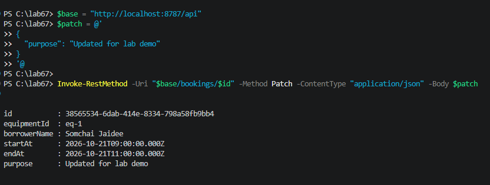
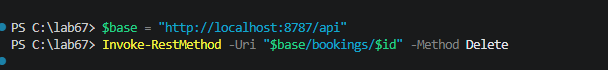
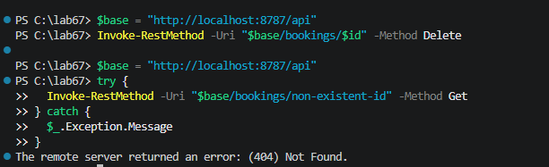

# Test Evidence

Base API URL used for testing:

`http://localhost:8787/api`

> This test set was run in PowerShell using `Invoke-RestMethod` against a fresh local server instance. The booking lifecycle is created with a non-overlapping time range so the booking ID is available for the later GET/PATCH/DELETE checks.

## Reset server

```powershell
$base = "http://localhost:8787/api"

$p = (Get-NetTCPConnection -LocalPort 8787 -ErrorAction SilentlyContinue | Select-Object -ExpandProperty OwningProcess -First 1)
if ($p) { Stop-Process -Id $p -Force }

cd C:\lab67
$env:PORT = 8787
npm start
```

## Case 1 — GET equipment list

Command:

```powershell
$base = "http://localhost:8787/api"
Invoke-RestMethod -Uri "$base/equipment" -Method Get
```


Expected: `200` and at least two equipment records.

## Case 2 — Create valid booking

Command:

```powershell
$base = "http://localhost:8787/api"
$valid = @'
{
  "equipmentId": "eq-1",
  "borrowerName": "Somchai Jaidee",
  "startAt": "2026-10-21T09:00:00.000Z",
  "endAt": "2026-10-21T11:00:00.000Z",
  "purpose": "Class presentation"
}
'@

$booking = Invoke-RestMethod -Uri "$base/bookings" -Method Post -ContentType "application/json" -Body $valid
$booking
$id = $booking.id
```


Expected: `201` and a booking object with a generated `id`.

## Case 3 — Invalid equipment ID

Command:

```powershell
$base = "http://localhost:8787/api"
$invalid = @'
{
  "equipmentId": "missing-eq",
  "borrowerName": "Test User",
  "startAt": "2026-10-21T09:00:00.000Z",
  "endAt": "2026-10-21T11:00:00.000Z",
  "purpose": "Demo"
}
'@

try {
  Invoke-RestMethod -Uri "$base/bookings" -Method Post -ContentType "application/json" -Body $invalid
} catch {
  $_.Exception.Message
}
```


Expected: `400` with a JSON error explaining that the equipment ID does not exist.

## Case 4 — Booking time conflict

Command:

```powershell
$base = "http://localhost:8787/api"
$conflict = @'
{
  "equipmentId": "eq-1",
  "borrowerName": "Suda Dee",
  "startAt": "2026-10-21T10:30:00.000Z",
  "endAt": "2026-10-21T12:00:00.000Z",
  "purpose": "Conflict test"
}
'@

try {
  Invoke-RestMethod -Uri "$base/bookings" -Method Post -ContentType "application/json" -Body $conflict
} catch {
  $_.Exception.Message
}
```


Expected: `409` with a conflict error for overlapping time on the same equipment.

## Case 5 — Get a single booking

Command:

```powershell
$base = "http://localhost:8787/api"
Invoke-RestMethod -Uri "$base/bookings/$id" -Method Get
```


Expected: `200` and the matching booking object for the newly created `id`.

## Case 6 — Update a booking

Command:

```powershell
$base = "http://localhost:8787/api"
$patch = @'
{
  "purpose": "Updated for lab demo"
}
'@

Invoke-RestMethod -Uri "$base/bookings/$id" -Method Patch -ContentType "application/json" -Body $patch
```


Expected: `200` and the booking updated with the new purpose.

## Case 7 — Delete a booking

Command:

```powershell
$base = "http://localhost:8787/api"
Invoke-RestMethod -Uri "$base/bookings/$id" -Method Delete
```


Expected: `204` or no content after successful deletion.

## Case 8 — Not found resource

Command:

```powershell
$base = "http://localhost:8787/api"
try {
  Invoke-RestMethod -Uri "$base/bookings/non-existent-id" -Method Get
} catch {
  $_.Exception.Message
}
```


Expected: `404` JSON error indicating the booking does not exist.
